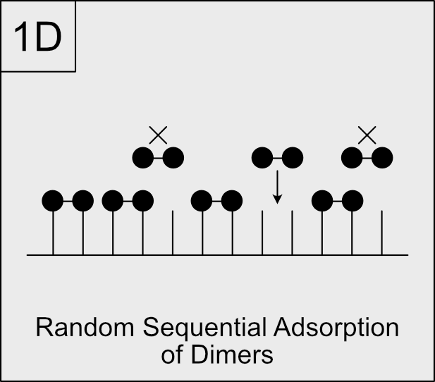

[[Main Index](../index.md)]

---

# 1D Random Sequential Adsorption (RSA) of Dimers

## Index

- [Introduction](#introduction)
   - [Model Description](#model-description)
   - [Simulation Algorithm - Pseudocode](#simulation-algorithm---pseudocode)
   - [Results Processing](#results-processing)
- [Program Implementation](#program-implementation)
   - [Setting Up the Configuration File](#setting-up-the-configuration-file)
   - [Running the Simulation - Command Line Interface (CLI)](#running-the-simulation---command-line-interface-cli)
   - [Running the Simulation - From a Python Script](#running-the-simulation---from-a-python-script)
   - [Saving and Loading a Simulation](#saving-and-loading-a-simulation)
   - [Analysis and Results](#analysis-and-results)

## Introduction

Random sequential adsorption (RSA) is a fundamental process in which particles
are irreversibly, and randomly, deposited onto a substrate. Once particles are
deposited, they cannot be removed or rearranged. As particles are added, the
subtrate becomes populated and eventually saturates, reaching a state where no
more particles can be added due to the constraints of the system.

RSA has been widely used to model various physical, chemical, and biological
processes, such as the adsorption of molecules on surfaces, the packing of
colloidal particles, and the formation of thin films. RSA is useful to
understand some litography techniques where the deposition process follows a
random sequential adsorption mechanism.

### Model Description



Consider a one-dimensional discrete substrate of length \(`L`\) where particles
can adsorb, but cannot desorb or move once they are adsorbed. The lattice can be
finite or infinite, i.e., in the case of an infinite lattice, it is modeled as a
lattice with periodic boundary conditions, `x = x + L`, where `x` is the
position on the lattice and `L` is the length of the lattice, that is also the
period of the lattice.

Each site can have one of two states: occupied or empty, and each site can only
be occupied by one particle. In this model, two joined particles, i.e., dimers,
are deposited onto the lattice at a constant rate `k`. Since the rate is
constant, `k` can be set to 1 without loss of generality. For a dimer to be
adsorbed, two adjacent sites must be empty. If the deposition attempt is
successful, the two sites become occupied and no more particles can be adsorbed
on those sites. If any of the sites where the particle is trying to adsorb is
already occupied, the deposition attempt fails and the system remains unchanged.

The different quantities to be tracked are defined as follows:

- `L`: Length of the lattice.

- `t`: The physical time of the system, that is proportional to the number of
  of deposition attempts. The proportionality constant is the inverse length of
  the lattice, `1/(kL)`, over the total rate of the system; since the deposition
  rate is set to 1, `k = 1`, it can be simplied to `1/L`.  Thus, the elapsed
  time can be calculated as `t = Na / L`, where `Na` is the number of deposition
  attempts.

- `C(t)`: The coverage of the lattice at time `t`, defined as the fraction of
  occupied sites on the lattice. It is calculated as `C(t) = N(t) / L`, that is
  the percentage of occupied sites, where `N(t)` is the number of occupied sites
  at time `t`.

- `S(t)`: The percentage of single sites that are **NOT** occupied at time `t`.
   Can be calculated as `S(t) = 1 - C(t)`.

- `D(t)`: The percentage of pair sites that are **NOT** occupied at time `t`.
   This gives an idea of how many more dimers can be adsorbed on the lattice at
   time `t`.

- `T(t)`: The percentage of three consecutive sites that are **NOT** occupied at
   time `t`.

A single simulation is not enought to determine the behavior of the system,
since the process is stochastic and there might be multiple outcomes for the
same initial conditions, and number of deposition attempts. Therefore, it is
necessary to perform multiple simulations and average the different ensembles to
obtain a more accurate representation of the system's behavior.

### Simulation Algorithm - Pseudocode

The following pseudocode outlines the algorithm for simulating the 1D RSA of
dimers. Additional actions like saving the state of the system, or data
processing are not included in the pseudocode, but they are implemented in the
program:

1. Define a lattice of length `L` initialized with all sites empty.
1. Setup the variables:
   - The variables where to save the results of `C(t)`, `S(t)`, `D(t)`, and
     `T(t)`.
   - Define a variable where to track the accumulated statistics of the
     different repetitions of the simulation, call it `stats`, that must contain
     the variables to save the accumulated results of `C(t)`, `S(t)`, `D(t)`,
     and `T(t)`.
   - A variable that defines the number of repetitions of the simulation, call
     it `nsims`.
   - A variable that defines the number of deposition attempts, call it
     `nattempts`.
1. For each simulation from `1` to `nsims`:
   1. Empty the lattice and reset the time `t` to `0`.
   1. Empty the statistics variables `C(t)`, `S(t)`, `D(t)`, and `T(t)`.
   1. For each deposition attempt from `1` to `nattempts`:
      1. Increase the number of deposition attempts `Na` by 1, `Na = Na + 1`.
      1. Randomly select a site `i` on the lattice, i.e., a site from `0` to
        `L-1`; because the array indexing starts at `0`.
      1. Attempt to deposit a dimer on the selected site `i` and the adjacent
         site `i+1`. In the case of a periodic lattice, if the selected site is
         `L-1`, the adjacent site will be `0`.
      1. Increase the time `t` by 1, since integer numbers are more accurate to
         track than floating point numbers, and the time can be calculated as
         `t = Na / L`.
      1. Record the values of `C(t)`, `S(t)`, `D(t)`, and `T(t)` at the current
         time `t`.
      1. If the maximum number of deposition attempts is reached, exit the loop;
         otherwise, continue to the next deposition attempt.
   1. Update the `stats` by accumulating the values of `C(t)`, `S(t)`, `D(t)`,
      and `T(t)` at the given times.
   1. Increment the number of simulations performed.
   1. If the maximum number of simulations has been exceeded, exit the loop;
1. Process the accumulated statistics in `stats` to obtain the average values of
   `C(t)`, `S(t)`, `D(t)`, and `T(t)` at the different times.
1. Save the results to a file or display them as needed.
1. Finish the program successfully.

If at any point the simulation crashes, or an error occurs, the program will be
left to fail, and the error message will be printed to the console. Details on
how to run the program, and how to save and load simulations are provided in the
next section.

### Results Processing

#### Accumulating the Statistics

For consistency, the lattice must be at least 4 sites long, since the quantity
`T(t)` tracks the percentage of three consecutive sites that are not occupied,
and if the lattice is shorter than 4 sites, and the lattice is periodic, there
will be redundacy when calculating `T(t)`.

The process for gathering the statistics works the same for any of the
quantities being tracked, i.e., `C(t)`, `S(t)`, `D(t)`, and `T(t)`; thus, the
process is described in a general way, and it can be applied to any of the
quantities being tracked. For simplicity, the process is described for the
quantity `C(t)`.

For the `n`th repetition, where `1 <= n <= nsims`, of the simulation, define a
variable `Cn`
```text
Cn = [[0, 0], [1, 0], [2, 0], ...,[Na, 0]]
```
and `Cn(t) = [t, Cn(t)]`, where `0 <= t <= Na`, and `Na` is the total number of
deposition attempts. _After_ an attempt `i` (`0 <= i <= Na`) is made, count
the number of occupied sites `Nn(i)` on the lattice, and register the value
at the location `Cn(i) = [i, Nn(i)]`. Repeat this process for each deposition
attempt. When the number of deposition attempts `Na` is reached the variable
`Cn` will contain the values of `Cn(t)` at the different times:
```text
Cn = [[0, Nn(0)], [1, Nn(1)], [2, Nn(2)], ...,[Na, Nn(Na)]]
```
that is:
```text
Ci(t) = [time_i * Length, number of occupied sites at time_i]
```
Accumulate the values of `Cn(t)` in the variable `stats.C` such that:
```text
stats.C = [
    [0, 0],
    [1, N1[1] + N2[1] + ... + Nnsims[1]],
    [2, N1[2] + N2[2] + ... + Nnsims[2]],
    ...,
    [Na, N1[Na] + N2[Na] + ... + Nnsims[Na]]
]
```
that is:
```text
stats.C(i) = [time_i * Length, sum(1, NSims, Ni(Na))]
```
Thus, to convert the number of attempts to time, the first element of each pair
in `stats.C` is multiplied by `1/L`, where `L` is the length of the lattice.
To get the average coverage at time `t`, the second element of each pair in
`stats.C` is divided by the number of simulations, `nsims` multiplied by the
length of the lattice, `L`. This will turn the total coverage into the average
percentage coverage.
```text
stats.c(i) = [stats.C(i)[0] / L, stats.C(i)[1] / (nsims * L)]
```
Such that:
```text
stats.c = [
    [0, 0],
    [time_1, average coverage percentage at time_1],
    [time_2, average coverage percentage at time_2],
    ...,
    [time_Na, average coverage percentage at time_Na]
]
```
The same reasoning can be applied to the other quantities being tracked, i.e.,
`S(t)`, `D(t)`, and `T(t)`, to obtain the average values of those quantities at
the different times.

The advantage of this method of accumulating the statistics as integer numbers
is that the numbers are always exact, until the final step of calculating the
average values, since the integer numbers are not subject to rounding errors,
as opposed to floating point numbers.

## Program Implementation

### Setting Up the Configuration File

Before running the simulation, it is necessary to set up the configuration file
that contains the different options for the simulation:
```json
{
    "history": {
        "file": "history.txt",
        "frequency": 0
    },
    "history_lattice": {
        "file": "lattice.txt",
        "frequency": 0
    },
    "output": {
        "file": "output.txt",
        "working": ""
    },
    "simulation": {
        "attempts": 100,
        "length": 100,
        "periodic": false,
        "repetitions": 10,
        "seed": -1
    }
}
```
The description of the different options is:

- `history`: Contains the options related to periodically saving the state
    of the simulation, in the case the simulation is interrupted, for whatever
    reason, and needs to be resumed later.
    - `file`: The name of the file where to save the state of the
        simulation. This must be the name of the file, without the path, since
        the file will be saved in the working directory defined in the
        `output` section.
    - `frequency`: The frequency, in terms of the number of deposition
        attempts, at which to save the state of the simulation. If the value
        is `0`, the state of the simulation will not be saved. If the
        frequency is equal to the number of deposition attempts, the state of
        the simulation will be saved at the end of each simulation repetition.

- `history_lattice`: Contains the options related to periodically saving the
    state of the lattice, in the case that instanteous snapshots of the
    lattice are needed for visualization or analysis purposes.
    - `file`: The name of the file where to save the state of the
        lattice. This must be the name of the file, without the path, since
        the file will be saved in the working directory defined in the
        `output` section.
    - `frequency`: The frequency, in terms of the number of deposition
        attempts, at which to save the state of the lattice. If the value
        is `0`, the state of the lattice will not be saved. If the
        frequency is equal to the number of deposition attempts, the state of
        the lattice will be saved at the end of each lattice repetition.

- `output`: Contains the options related to saving the results of the
    simulation.
    - `file`: The name of the file where to save the final results of the
        simulation. This must be the name of the file, without the path, since
        the file will be saved in the working directory defined in the
        `output` section.
    - `working`: The path of the working directory where to save the results
        of the simulation. If the value is an empty string, the results will
        be saved in the current directory. For this to be properly set, the
        path to the directory **MUST** exist.
- `simulation`: Contains the options related to the simulation itself.
    - `attempts`: The number of deposition attempts to perform in each
        simulation repetition.
    - `length`: The length of the lattice.
    - `periodic`: A boolean value that indicates whether the lattice is
        periodic or not. True, if the lattice is periodic; False, otherwise.
    - `repetitions`: The number of repetitions to perform for the
        simulation.
    - `seed`: The seed to use for the random number generator. If the value
        is `-1`, the seed will be set to the current system time, that is,
        the seed will be different for each simulation run.

The quantity types in the configuration file must match those in the default
configuration file, otherwise, the program will fail; however, the program will
check  these types when loading the configuration file.

### Running the Simulation - Command Line Interface (CLI)

With the configuration file set up, the simulation can be run from the command
line interface (CLI) as follows:

1. Open a terminal window.

1. If the virtual environment where the `stochastic` package is installed is not
   activated, activate it. Otherwise, make sure that the `stochastic` package is
   installed in the current Python environment.

1. From the terminal type the command:
   ```bash
   stochastic-1d-rsa-dimers -c path/to/configuration_file.json
   ```
   where `path/to/configuration_file.json` is the path to the configuration
   file set up in the previous section.

1. Wait for the simulation to finish. The results will be saved in the working
   directory defined in the configuration file, with the name defined in the
   `output` section of the configuration file.

### Running the Simulation - From a Python Script

### Saving and Loading a Simulation

### Analysis and Results
